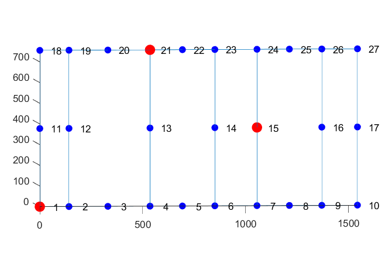
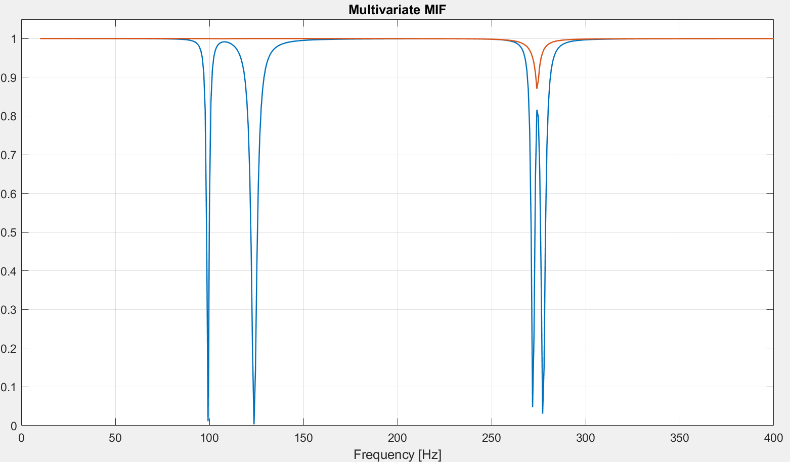
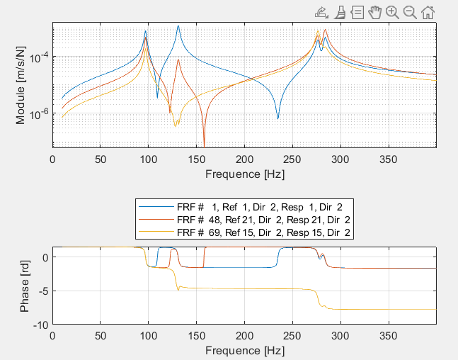
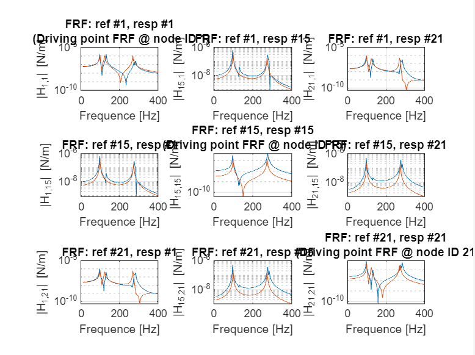
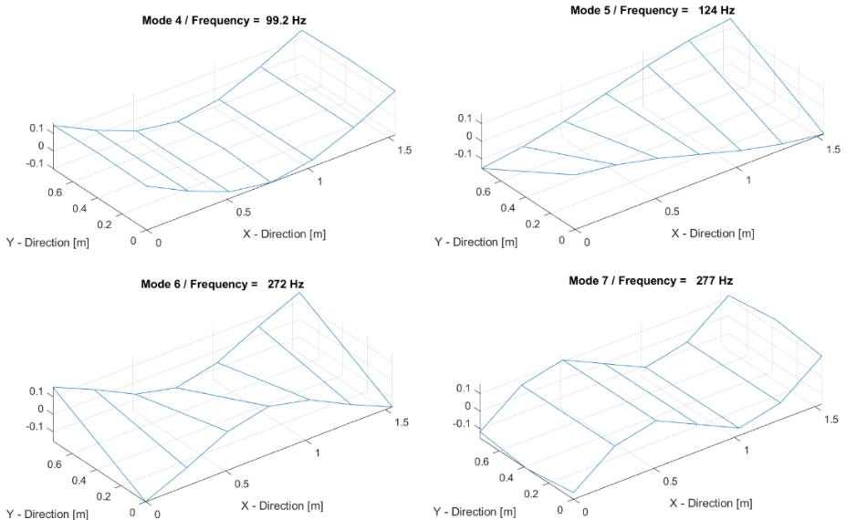
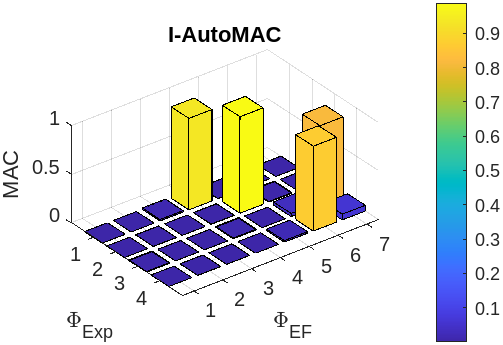
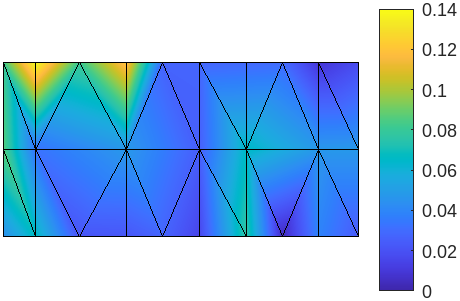
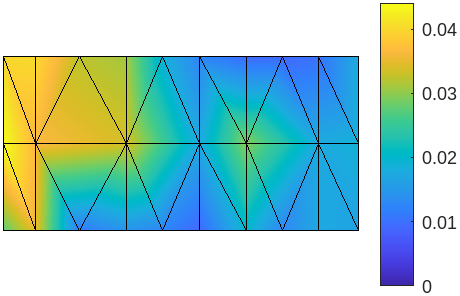
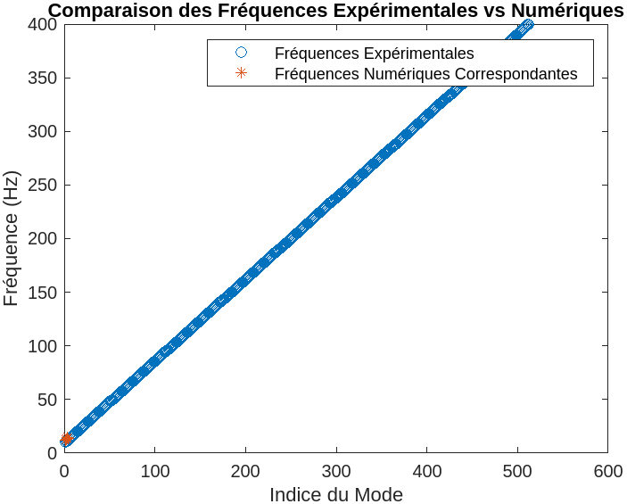

# Experimental Modal Analysis of a Free Steel Plate

MATLAB workflow and experimental study identifying and validating the vibration modes of a free-boundary rectangular steel plate.

This was developed for the *Expérimentation et validation de modèles en dynamique des structures* course. It combines measured frequency-response functions (FRFs), experimental modal analysis (EMA), and comparison with a finite-element (FE) model.

## What the project demonstrates

- Pre-test design of sensor and shaker layouts, including the impact of nodal lines.
- MIMO experimental modal analysis using 27 response sensors and three excitation points.
- FRF quality checks: colocated antiresonances, phase rotations, and reciprocity.
- Identification of natural frequencies, damping ratios, poles, modal residues, and complex/real mode shapes.
- Experimental-to-FE validation using MAC, COMAC, eCOMAC, frequency comparison, and FRF overlays.

The experimental and FE resonance frequencies show overall agreement. The work also demonstrates why exciter/sensor placement matters, especially for closely spaced modes around 280 Hz.

The FE pre-test found nearby modes around 273 Hz and 277 Hz, so two independent shakers are advisable if the modes cannot be separated experimentally. The MATLAB workflow handles a 27-response × 3-reference FRF layout and multi-reference mode-shape identification.

## Repository guide

| Path | Description |
| --- | --- |
| [`Versions code/main_EMA_TD4_3.m`](<Versions code/main_EMA_TD4_3.m>) | Multi-reference MATLAB EMA workflow; the best starting point for the three-shaker configuration. |
| [`Versions code/main_EMA_R.m`](<Versions code/main_EMA_R.m>) | Earlier, single-reference-oriented EMA variant. |
| [`PROJECT_CONTEXT.md`](PROJECT_CONTEXT.md) | Detailed project, code, input/output, and validation context. |
| [`SUPPORTING_NOTES_SUMMARY.txt`](SUPPORTING_NOTES_SUMMARY.txt) | Consolidated implementation and experimental-design notes from the removed working documents. |
| `Rapport DYNAE.docx` | Detailed technical report and extended discussion (French). |

## Method overview

```text
UFF FRFs + UNV geometry
          |
          v
sign/unit normalization -> mobility FRFs
          |
          v
FRF diagnostics + MvMIF resonance candidates
          |
          v
LSCE pole identification -> modal residues -> complex mode shapes
          |
          v
real mode extraction -> Auto-MAC / mode animation / FE comparison
```

The scripts can also run ODS (operating deflection shapes) and numerical modal appropriation. EMA is the default analysis path.

## Results and validation

### Experimental setup

The experiment measures a free-boundary rectangular steel plate with 27 response sensors and three shakers, giving 81 FRFs. The third shaker falls on nodal lines for some modes and degrades the identification data; the EMA pole-identification step therefore uses the first 54 FRFs from the two usable references.



### Resonance identification

The multivariate mode-indicator function (MvMIF) makes resonance candidates visible across the MIMO measurement set. A closely spaced pair is expected near 280 Hz; the supporting FE pre-test places this pair near 273 Hz and 277 Hz, explaining the need for multiple independent shakers.



### FRF quality checks and reconstruction

Two qualitative checks confirm the FRF data before modal identification:

- Colocated FRFs show an antiresonance between resonances and the expected phase rotations.
- Reciprocal FRFs are symmetric, supporting the assumed reciprocal/linear behaviour.

EMA then identifies poles, damping and residues, and reconstructs FRFs for comparison with measured data. Agreement in resonance locations is the primary evidence that the identified model captures the plate dynamics; amplitude differences indicate where modeling or experimental conditions may differ.





### Identified mode shapes

The analysis produces complex mode shapes, aligns their phase across reference excitations, and extracts real normal modes for interpretation and animation. The pre-test emphasizes that shakers and sensors must avoid nodal lines and cover moving regions of the plate.



### Finite-element validation

Experimental and FE natural frequencies have good overall agreement. Validation combines global and coordinate-level measures:

- **MAC:** compares complete experimental and FE mode shapes; high matched entries indicate a good modal correspondence.
- **COMAC/eCOMAC:** highlight coordinates with local differences. They identify where correlation is weaker, but do not on their own prove the physical origin of a discrepancy.
- **Frequency comparison:** verifies that the experimental and numerical modal-frequency trends agree.






See [`assets/figures/README.md`](assets/figures/README.md) for figure traceability and asset conventions.

## Requirements

- MATLAB (the scripts use MATLAB plotting and linear-algebra functions).
- An implementation of `uffread` for UFF/UNV import.
- An implementation of `lsce` for least-squares complex-exponential pole identification.
- Measurement files referenced by the scripts: `fram_frf.uff` and `fram_geo.unv`.

The measurement files and the `uffread`/`lsce` implementations are not included here, so a complete run is not reproducible from this repository alone.

## Running the analysis

1. Add `uffread` and `lsce` to the MATLAB path.
2. Put the UFF/UNV measurement files in the working directory, or update `Data_File` and `Model_File` in the script.
3. Open `Versions code/main_EMA_TD4_3.m`, set `Method = 'EMA'`, and run it section by section.
4. Use the plotted FRFs and synthesized-FRF overlays to check the fit. The script pauses between diagnostics.
5. Use the saved `PhiExp_EMA.mat` with FE modes for MAC/COMAC/eCOMAC validation.

## Important implementation note

The third shaker is excluded from modal identification because its position lies on nodal lines for some modes. `main_EMA_TD4_3.m` correctly limits LSCE pole identification to the first 54 FRFs, but its later residue/mode averaging loops still include all references. Before applying this code to this setup, make that exclusion consistent throughout the residue and mode-shape stages. See [`PROJECT_CONTEXT.md`](PROJECT_CONTEXT.md) for details.

## Project status

Course project / archival portfolio repository. The code is retained as an analysis record and includes its original interactive workflow. A future cleanup could package the script into functions, add the missing data/toolbox dependencies, parameterize channel selection, and include reproducible validation outputs.

## Documentation

The source code and detailed technical report are primarily in French; this README and [`PROJECT_CONTEXT.md`](PROJECT_CONTEXT.md) provide an English entry point. Read `Rapport DYNAE.docx` for the extended methodology, observations and discussion behind the project.
